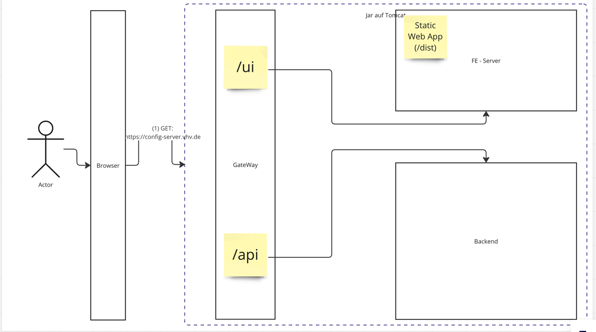

# How to Build InspectIT Gepard Config-Server

## Prerequisites
Please make sure you have the following tools installed on your machine:
- A big cup of coffee
- A Java Development Kit (JDK) with version 21 or higher
- A working internet connection (for downloading dependencies)
- Docker (optional, for running the application in a container and in Postgres mode.)

Thats it for now. 

## Building the Project
To build the project, simply run the following command in the root directory of the project:
```shell
./gradlew 
```

> [!TIP]  
> You might have installed an auto-formatter in your IDE. It may break the installed spotless code-style. In this case, the build will not be successfull. Please run ```./gradlew :server:spotlessApply``` to fix this issue.

## In depth explanation for developers
The project currently consists of three modules:

### `server`
This module is responsible for talking with the agents and providing data to the frontend.
It is built with Spring Boot 3 and uses a database to store information about connected agents.

### `ui`
Here you can find the frontend part of the application.
It is build with Next.js and React and uses TailwindCSS for styling.

### `client`
This module could be used, if we want to switch to a plain react frontend in the future.
This also gives a feeling for how easy it is to switch to a different frontend technology.
For now, it is not used and commented out in the `settings.gradle` file.

### Architectural Considerations
For the sake of simplicity in deployment, and because the legacy system InspectIT Ocelot is also using this approach, 
I decided to set up a build, which bundles the frontend into static assets and serves them from the backend. 
This way, we can deploy the application as a single jar file, which contains everything we need.
In a simple diagram-thingy it looks like this:


This approach looks pretty straightforward, because, as you can see:

There is no additional node.js server needed.

- The Browser asks for ui resources: The server serves them.
- The Browser asks for data: The server serves them.

Sad thing about this: Most of the modern frontend frameworks like next.js or nuxt.js are not really made for this approach.
This is because they are made for server-side rendering (SSR) and static site generation (SSG) and not for a traditional SPA Application.

The main problem kicks in, when we want to use dynamic routes.
You can only use routes like `/pages/[id]` if you know all pages at build time.

Do we know all agents at build time? I think you know the answer, if you read that far.

Did you ever wonder why the Ocelot Config Server only consists of a few pages and feels that old?
Exactly because of this.

If we want to serve the frontend via static assets, it would be a much better approach to use a plain SPA,
which fetches the data from the server and handles routing on the client side. 

And to be honest: Do we really need server-side rendering for this application? I think not.

Let´s quickly summarize the benefits of an SSR approach and see if we really need them:
- We can do Search Engine Optimization (SEO). I don´t think google needs to Index our configuration server.
- We can cache the rendered page, which only works for not personalized pages, which unfortunately doesn't apply for most pages in our app.
- if we have 100 users on the page with iPhones at the same time, if our servers have more performance than their 100 iPhones the rendering would be slightly faster. Do we have this power on the server and how important is the rendering performance for a developer tool?
- instead of js files and JSON we push huge html pages to the client. Wasn't the big performance benefit of Angular and React that after the bundles where in the browser cache the only thing we had to push to the client was some JSON data instead of the whole html?
- Oh, and it is less vulnerable against XSS. But this is not important in a non-public facing application.


So what alternatives do we have?

1. We could run a separate node.js server for the frontend. This allows us to use all the cool features of Next.js, Nuxt.js and ShootMeDown.js.
2. We could just use a plain Single-Page Application (SPA) with React, Angular, Vue or whatever you like and move routing completely to the client. 
3. We could use a Next or Nuxt to generate a static side and rely on our capabilities to handle routing, redirects, etc. ourself in the backend. 
But why should we do that, if we can just use a plain SPA? Easy answer: We dont send the whole application to the browser, but only the js and html which is needed on the page. This means better performance.
The fact, that our application is highly interactive, agents fetching configuration all the time and things have to go fast, makes me think that the second approach is the better one.
